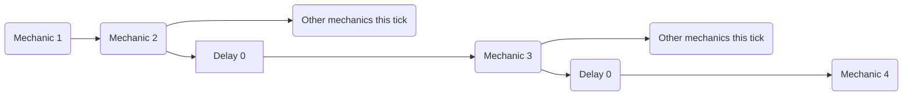

The [delay] mechanic can be used to apply a delay not only *between* ticks, but also inside of the same tick via a `delay 0` mechanic. 

# DISCLAIMER
This is not an intended mechanic. It's just a happy accident that, somehow, consistently works. Do not expect this to be cutting edge, as, again, this is more of a convenient bug

## Single Delay

You have to imagine each mechanic as a series of instructions that are executed orderly. In this scenario, using a `delay 0` mechanic allows you to "schedule" the subsequent mechanics to be executed *after* every other non delayed mechanic that tick.

While i have extensively tested this behavior after discovering it before documenting it, it's still very possible that new applications or game-breaking behaviors are still present. If you have any information useful to further expand this page and, by proxy, the knowledge available to every other MythicMobs user, let me know: [Lxlp's Discord Profile](https://discord.com/users/353257382811533322)


### Example
```yaml
ExampleMechanic:
  Skills:
  - skill{s=Skill1} @self
  - skill{s=Skill2} @self

Skill1:
  Skills:
  - delay 0
  - message{m="<skill.var.test>"}

Skill2:
  Skills:
  - setvariable{var=test;val=1}
```
> Executing the ExampleMechanic will output
>> - `UNDEFINED` if no delay 0 is used
>> - `1` otherwise

## Multiple Delays
This behavior works with multiple delays too: each time a new `delay 0` is executed, the subsequent mechanics are pushed a the back of the execution line *again*




### Example
```yaml
ExampleMechanic:
  Skills:
  - skill{s=SkillMessage} @self
  - skill{s=Skill1} @self
  - skill{s=Skill2} @self

Skill1:
  Skills:
  - delay 0
  - setvariable{var=test;val=2}

Skill2:
  Skills:
  - setvariable{var=test;val=1}

SkillMessage:
  Skills:
  - delay 0
  - delay 0
  - message{m="<skill.var.test>"}
```
> Executing the ExampleMechanic will output
>> - `UNDEFINED` if no delay 0 is used inside of SkillMessage
>> - `1` if only one delay 0 is used inside of SkillMessage
>> - `2` if all delays are used inside of SkillMessage


<!-- LINKS -->
[delay]: /Skills/Mechanics/delay