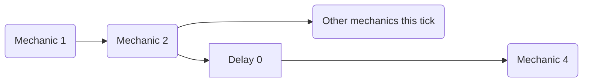

The [delay] mechanic can be used to apply a delay not only *between* ticks, but also inside of the same tick via a `delay 0` mechanic. 

## Single Delay

You have to imagine each mechanic as a series of instructions that are executed orderly. In this scenario, using a `delay 0` mechanic allows you to "schedule" the subsequent mechanics to be executed *after* every other non delayed mechanic that tick.



### Example
```yaml
ExampleMechanic:
  Skills:
  - skill{s=Skill1} @self
  - skill{s=Skill2} @self

Skill1:
  Skills:
  - delay 0
  - message{m="<skill.var.test>"}

Skill2:
  Skills:
  - setvariable{var=test;val=1}
```


## Multiple Delays
This behavior works with multiple delays too: each time a new `delay 0` is executed, the subsequent mechanics are pushed a the back of the execution line *again*


### Example
```yaml
ExampleMechanic:
  Skills:
  - skill{s=SkillMessage} @self
  - skill{s=Skill1} @self
  - skill{s=Skill2} @self

Skill1:
  Skills:
  - delay 0
  - setvariable{var=test;val=2}

Skill2:
  Skills:
  - setvariable{var=test;val=1}

SkillMessage:
  Skills:
  - delay 0
  - delay 0
  - message{m="<skill.var.test>"}
```


<!-- LINKS -->
[delay]: /Skills/Mechanics/delay