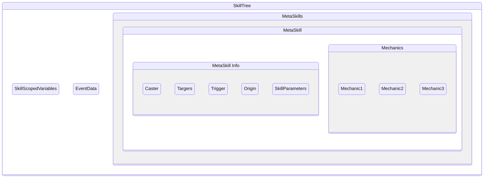

SkillTrees are an implicit feature of Mythic and, while they cannot directly invoked like [Metaskills] or otherfeatures, play just as an important of a role.  

SkillTrees are **created each time a mechanic is fired by a trigger**, and it is the place where skill scoped [variables] are stored and inside which [metaskills] exist

# SkillTree Structure



## Skill Scoped Variables

Since they exist in the skilltree itself, skill-scoped variables can be accessed by any [metaskill] in the skilltree from the moment they are created, regardless of which [metaskill] created them


## MetaSkills
Each [Metaskill] that is being called in the SkillTree has their own set of data regarding who the caster, target and trigger is:
- The Target is whoever has been targeted or inherited when calling the [Metaskill], and inside the metaskill itself it is the Inherited Target(s)
```yaml
  Skills:
  - skill{s=ExampleSkill} @PIR{r=10} ~onInteract
```
> The ExampleSkill metaskill that is being executed will have every player in a 10 blocks radius as the inherited target.

- The Trigger is first set as the entity that triggered the SkillTree initially. Each time a new metaskill is called, it inherits the trigger of the calling metaskill, unless it has been overridden by the [sudoskill]'s mechanic `casterastrigger` attribute, in which case the trigger from that metaskill forth will become the caster of the sudoskill mechanic


<!-- LINKS -->
[metaskill]: /Skills/Metaskills
[metaskills]: /Skills/Metaskills
[variables]: /Skills/Variables